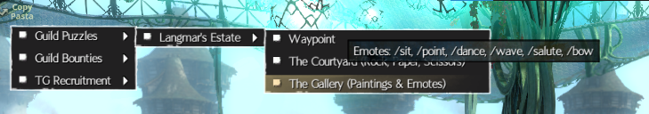
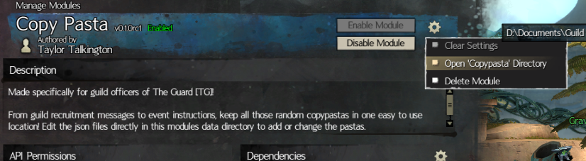

# Copy Pasta



From guild recruitment messages to event instructions, keep all those random copypastas in one easy to use location! Copy Pasta is a BlishHUD module that provides easy access to frequently used text snippets that are copied to the clipboard on selection for pasting into /map or /squad chat. 

## Installation

1. Download the module file, `Copy Pasta.bhm` from the assets of the [latest release](https://github.com/The-EG/BlishHUD-CopyPasta/releases/latest).
2. Place this file into BlishHUD's `modules` folder. You can find this by right clicking on the BlishHUD icon in your system tray and selecting `Open Settings Folder`. This is typically `My Documents\Guild Wars 2\addons\blishhud\modules`.
3. Place any pasta jsons into the `copypasta` folder. This folder is in the same place as the `modules` folder above. If you haven't run BlishHUD since installing the module, you may need to create it. Or you can restart BlishHUD, find this module in the 'Manage Modules' section of BlishHUD settings, click the 'gear' icon next to the "Enable Module" button and select "Open 'copypasta' Directory".
  
4. Restart BlishHUD

## Custom CopyPastas

The text snippets shown can be customized by adding or changing the json files in the 'copypasta' directory described in the above installation instructions.

The basic format is:

```json
{
  "A menu": {
    "A sub menu": {
      "An item": "with some text to copy to clipboard",
      "Another Item": "with some different text to copy"
    },
    "A third item": "yet more text!"
  },
  "An item in the root menu": "foo and bar",
  "An multiline copypasta": "A longer copypasta that has multiple lines.\nThis is a second line."
}
```

Menus can be nested. There is no checking for duplication between files. If multiple files define the same menu, multiple menus with the same name (but possibly different children) will be defined.

## Reloading CopyPastas

After editing the json files you can right click on the CopyPasta icon in game and select 'Reload CopyPastas.' This will rebuild the menus for all files without the need to restart BlishHUD.
